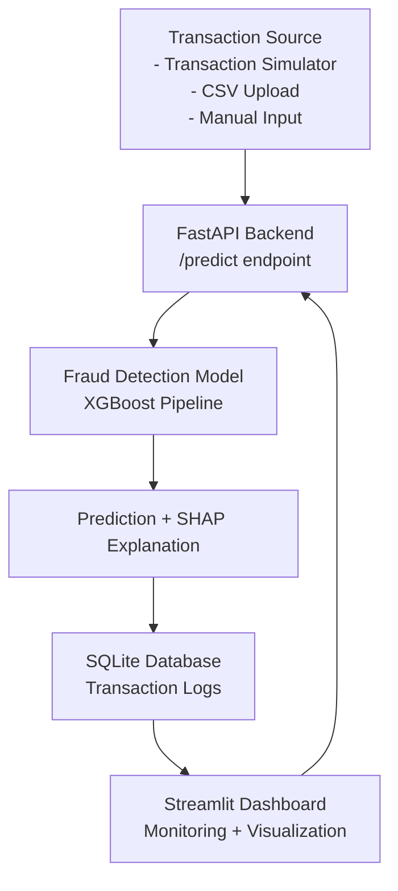

# Fraud Detection System


## Overview
This project predicts fraudulent credit card transactions using a trained XGBoost model. It provides a FastAPI backend for real-time predictions, a Streamlit dashboard for monitoring, SHAP explanations for transparency, and SQLite logging for traceability.

## Quick Demo
- Simulate or upload transactions and send them to the API.
- The model predicts Fraud vs Legitimate in milliseconds.
- SHAP highlights the top risk-driving features for each prediction.
- All predictions are stored in SQLite for auditing.
- Streamlit displays live metrics, trends, and explanations.

## System Architecture


## Model Performance
Metrics from the latest training run:
- ROC-AUC: 0.9732
- Precision: 0.53
- Recall: 0.86
- Confusion Matrix:
  ```
	[[56788   76]
	[   14   84]]
  ```

## Dashboard Preview


## API Example
```bash
curl -X POST http://127.0.0.1:8000/predict \
  -H "Content-Type: application/json" \
  -d '{"Time":0.0,"Amount":149.62,"V1":-1.359807,"V2":-0.072781,"V3":2.536346,"V4":1.378155,"V5":-0.338321,"V6":0.462388,"V7":0.239599,"V8":0.098698,"V9":0.363787,"V10":0.090794,"V11":-0.551600,"V12":-0.617801,"V13":-0.991390,"V14":-0.311169,"V15":1.468177,"V16":-0.470401,"V17":0.207971,"V18":0.025791,"V19":0.403993,"V20":0.251412,"V21":-0.018307,"V22":0.277838,"V23":-0.110474,"V24":0.066928,"V25":0.128539,"V26":-0.189115,"V27":0.133558,"V28":-0.021053}'
```

## How to Run the Project
1. Install requirements:
	```bash
	pip install -r requirements.txt
	```
2. Start the API:
	```bash
	cd api
	uvicorn main:app --reload
	```
3. Start the dashboard (new terminal):
	```bash
	cd dashboard
	streamlit run app.py
	```

## Project Structure
```
fraud-detection-system
│
├── api/                 # FastAPI backend
│   └── main.py
│
├── dashboard/           # Streamlit dashboard
│   └── app.py
│
├── model/               # ML training scripts
│   ├── train.py
│   ├── fraud_pipeline.pkl
│
├── simulator/           # transaction simulation
│
├── docs/                # architecture diagrams & screenshots
│
├── requirements.txt
└── README.md
```

## Future Improvements
- Real-time transaction streaming with Kafka
- Graph-based fraud detection models
- Automatic model retraining pipeline
- Docker deployment
- Cloud deployment (AWS / GCP)
- Real-time fraud alerting system
